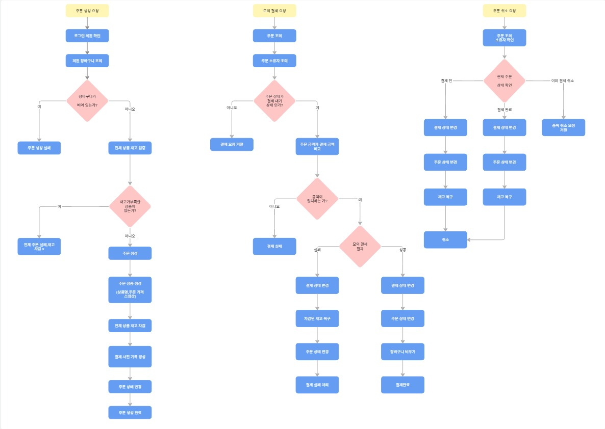
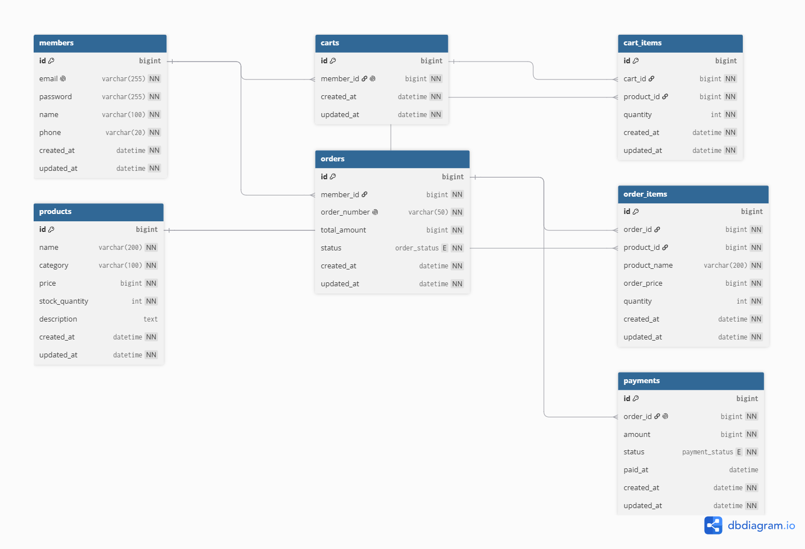
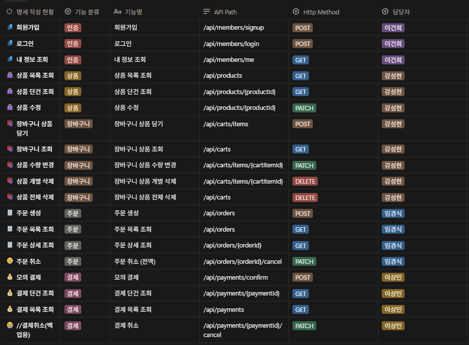

# 🛒 커머스 결제 시스템 재도전 프로젝트

> 상품 조회부터 장바구니, 주문, 모의 결제, 취소까지의 커머스 핵심 흐름을 구현하고, QueryDSL·인덱스·로컬 캐시·동시성 제어를 적용한 Java/Spring 팀 프로젝트입니다.

이 프로젝트는 **주문·결제·재고가 어떤 흐름으로 변경되는지 설명할 수 있는 구조**와 **데이터 정합성**에 집중했습니다.

기본 커머스 흐름을 완성한 뒤 다음 네 가지 심화 주제를 적용했습니다.

- QueryDSL을 이용한 상품 동적 조회
- 인덱스와 실행 계획을 이용한 조회 성능 분석
- Caffeine Local Cache를 이용한 반복 조회 비용 절감
- 재고 차감 과정의 동시성 제어

또한 React/Vite 기반의 시연 화면을 만들어 실제 Backend API를 호출하고, HTTP 요청·응답과 주요 비즈니스 시나리오를 확인할 수 있도록 구성했습니다.

---

## 목차

1. [프로젝트 소개](#1-프로젝트-소개)
2. [팀 구성과 역할](#2-팀-구성과-역할)
3. [기술 스택](#3-기술-스택)
4. [프로젝트 구조](#4-프로젝트-구조)
5. [서비스 흐름](#5-서비스-흐름)
6. [ERD](#6-erd)
7. [주요 기능](#7-주요-기능)
8. [핵심 기술 적용](#8-핵심-기술-적용)
9. [API](#9-api)
10. [Git 협업](#10-Git-협업)
11. [실행 방법](#11-실행-방법)
12. [프로젝트 정리](#12-프로젝트-정리)

---

## 1. 프로젝트 소개

### 프로젝트 배경

상품 → 장바구니 → 주문 → 결제 → 취소로 이어지는 커머스의 기본 흐름을 직접 설계하고 구현했습니다.

단순 CRUD에 머무르지 않고 다음 질문을 코드와 테스트로 확인하는 것을 목표로 했습니다.

### 핵심 범위

- Spring Security + JWT 기반 인증
- 상품 조건 조회와 페이지네이션
- 회원별 장바구니 관리와 소유권 검증
- 주문 생성 시 재고 선차감
- 주문 시점의 상품명·가격 스냅샷 저장
- 모의 결제 승인
- 결제 전·후 주문 취소와 재고 복구
- QueryDSL, Index, Local Cache, Concurrency Control 적용


### 공식 데이터 모델

공식 ERD는 다음 7개 테이블로 구성됩니다.

`members`, `products`, `carts`, `cart_items`, `orders`, `order_items`, `payments`

환불 관련 코드는 확장 구현으로 존재할 수 있지만 공식 ERD와 핵심 발표 범위에서는 제외했습니다.

---

## 2. 팀 구성과 역할

| 담당자 | 담당 영역 |
| --- | --- |
| 이건희 | Member, 인증/JWT |
| 강성현 | Product, Cart, Product QueryDSL 통합, Caffeine Cache, Frontend 통합 시연 |
| 임경식 | Order |
| 이상민 | Payment |

---

## 3. 기술 스택

| 구분 | 기술 |
| --- | --- |
| Backend | Java, Spring Boot, Spring MVC |
| Persistence | Spring Data JPA, Hibernate, QueryDSL |
| Database | MySQL |
| Authentication | Spring Security, JWT, BCrypt |
| Validation | Jakarta Bean Validation |
| Cache | Spring Cache, Caffeine |
| Build | Gradle |
| Frontend | React, Vite 7.3.6, pnpm |
| Test | JUnit 5, Mockito, Spring Boot Test |
| Collaboration | Git, GitHub, Pull Request |

### 기술 선택 이유

- **Spring Data JPA**: 엔티티 관계와 트랜잭션 단위의 상태 변경을 관리했습니다.
- **QueryDSL**: 카테고리·최소 가격·최대 가격처럼 선택적인 조건을 타입 안전한 동적 쿼리로 조합했습니다.
- **MySQL**: 실제 인덱스 실행 계획과 DB 락을 검증하기 위해 사용했습니다.
- **Caffeine**: 단일 애플리케이션 환경에서 외부 인프라 없이 로컬 캐시의 효과와 한계를 학습하기 위해 선택했습니다.
- **React/Vite**: Postman만으로는 한눈에 보기 어려운 회원가입→결제 흐름을 실제 사용자 시나리오로 시연하기 위해 사용했습니다.

---
## 4. 프로젝트 구조

```text
com.example.plus
├── domain
│   ├── member
│   │   ├── controller
│   │   ├── service
│   │   ├── repository
│   │   ├── entity
│   │   └── dto
│   │
│   ├── product
│   │   ├── controller
│   │   ├── service
│   │   ├── repository
│   │   ├── entity
│   │   └── dto
│   │
│   ├── cart
│   │   ├── controller
│   │   ├── service
│   │   ├── repository
│   │   ├── entity
│   │   └── dto
│   │
│   ├── order
│   │   ├── controller
│   │   ├── service
│   │   ├── repository
│   │   ├── entity
│   │   ├── dto
│   │   └── facade
│   │
│   └── payment
│       ├── controller
│       ├── service
│       ├── repository
│       ├── entity
│       ├── dto
│       └── facade
│
└── global
    ├── common
    │   ├── entity
    │   └── response
    ├── config
    │   ├── cache
    │   └── jpa
    ├── security
    │   └── jwt
    └── exception
        ├── business
        └── handler
```

도메인별로 Controller, Service, Repository, Entity, DTO를 분리했습니다.

주문과 결제처럼 여러 도메인의 흐름을 조합해야 하는 기능에는 Facade를 사용했습니다

## 5. 서비스 흐름



### 주문 생성

1. JWT에서 로그인 회원 ID를 확인합니다.
2. 회원의 장바구니 또는 선택된 장바구니 상품을 조회합니다.
3. 상품 재고를 검증합니다.
4. 주문 시점의 상품명·가격·수량을 `OrderItem`에 스냅샷으로 저장합니다.
5. 상품 재고를 선차감합니다.
6. 결제 대기 상태의 Payment를 생성합니다.
7. 주문을 결제 대기 상태로 저장합니다.

### 결제 승인

1. 주문과 결제 소유권 및 현재 상태를 확인합니다.
2. 서버가 보관한 주문 금액과 결제 금액을 비교합니다.
3. Payment를 결제 완료 상태로 변경합니다.
4. Order를 주문 완료 상태로 변경합니다.
5. 주문된 상품을 장바구니에서 제거합니다.

### 주문 취소

- 결제 전 취소: Payment를 실패 상태로, Order를 취소 상태로 변경하고 선차감 재고를 복구합니다.
- 결제 후 취소: Payment를 취소 상태로, Order를 취소 상태로 변경하고 재고를 복구합니다.
- 상태 변경과 재고 복구는 하나의 트랜잭션 안에서 처리합니다.

---

## 6. ERD



### 주요 관계

| 관계 | 설명 |
| --- | --- |
| Member 1 : 1 Cart | 회원은 하나의 장바구니를 사용합니다. |
| Member 1 : N Order | 회원은 여러 주문을 생성할 수 있습니다. |
| Cart 1 : N CartItem | 하나의 장바구니에 여러 상품을 담을 수 있습니다. |
| Product 1 : N CartItem | 하나의 상품이 여러 장바구니에서 참조될 수 있습니다. |
| Order 1 : N OrderItem | 하나의 주문은 여러 주문 상품으로 구성됩니다. |
| Product 1 : N OrderItem | 주문 상품은 원본 상품을 참조하면서 스냅샷도 저장합니다. |
| Order 1 : 1 Payment | 하나의 주문에는 하나의 결제 정보가 연결됩니다. |

### 핵심 제약과 설계

- `carts.member_id` UNIQUE: 회원당 Cart 1개
- `cart_items(cart_id, product_id)` UNIQUE: 동일 Cart 안의 동일 상품 중복 행 방지
- 동일 상품을 다시 담으면 새 행을 만들지 않고 수량을 합산
- `OrderItem`에 상품명·주문 가격·수량을 저장하여 이후 상품 정보가 바뀌어도 주문 당시 정보를 유지
- 장바구니 전체 비우기 시 Cart 엔티티는 유지하고 CartItem만 삭제

---

## 7. 주요 기능

### 7.1 회원과 인증

- 이메일·비밀번호 기반 회원가입과 로그인
- 로그인 성공 시 JWT 발급
- 인증 API에서 JWT principal의 회원 ID 사용
- 클라이언트가 `memberId`를 요청 값으로 직접 전달하지 않음
- 본인의 장바구니·주문·결제 자원만 접근할 수 있도록 소유권 검증

### 7.2 상품

- 카테고리, 최소 가격, 최대 가격을 조합한 목록 조회
- 페이지네이션과 최신순 정렬
- 상품 상세 조회
- 상품명·카테고리·가격·설명 부분 수정
- 상품 목록 조회 v1과 캐시 조회 v2 병행
- 상품 수정 성공 시 상품 목록 캐시 전체 무효화


### 7.3 장바구니

- 상품 추가
- 같은 상품 재추가 시 수량 합산
- 장바구니 목록과 총액 조회
- 수량을 최종 값으로 변경
- 상품 개별 삭제
- 장바구니 전체 비우기
- 재고 초과 요청 거절
- 다른 회원의 CartItem 접근 차단
- Cart가 없는 회원 조회 시 `200 OK`와 빈 장바구니 반환

**장바구니 단계에서는 재고를 차감하지 않습니다. 실제 재고 변경은 주문 생성 단계에서 수행합니다.**

### 7.4 주문

- 장바구니 상품을 이용한 주문 생성
- 주문 시 상품 정보 스냅샷 저장
- 주문 목록과 상세 조회
- 주문 생성 시 재고 선차감
- 결제 전·후 주문 취소와 재고 복구

### 7.5 결제

- 주문 생성 시 결제 대기 데이터 생성
- 모의 결제 승인
- 결제 금액과 주문 금액 검증
- 결제와 주문 상태 변경
- 중복 승인 방지
- 결제 완료 후 주문 상품의 장바구니 후처리

### 7.6 공통 처리

- DTO Validation
- `BusinessException`, `ErrorCode`, `GlobalExceptionHandler` 기반 공통 예외 처리
- 공통 성공 응답과 실패 응답
- 트랜잭션 단위의 주문·결제·재고 상태 변경

실패 응답 예시:

```json
{
  "success": false,
  "error": {
    "code": "PRODUCT_001",
    "message": "상품을 찾을 수 없습니다."
  }
}
```

---

## 8. 핵심 기술 적용

### 8.1 QueryDSL 동적 쿼리

#### 문제

상품 목록은 `category`, `minPrice`, `maxPrice`가 모두 선택값입니다. 조건 조합마다 Repository 메서드를 만들면 중복이 증가하고 변경에 취약해집니다.

#### 적용

- Product Custom Repository에서 동적 조건 구성
- 값이 없는 조건은 `where`절에서 제외
- 목록에 필요한 필드만 DTO로 조회
- content query와 count query 분리
- `page`, `size`를 적용해 `Page` 결과 반환

#### 결과

필터 없음부터 세 필터 전체 조합까지 하나의 조회 메서드로 처리하고, 기존 Product 목록 API의 외부 계약을 유지했습니다.

### 8.2 Index와 Query Tuning

상품 목록의 카테고리·가격 범위·정렬 조건을 대상으로 인덱스를 검토했습니다. 소량의 기본 데이터만으로 결론을 내리지 않고, 대량 데이터와 `EXPLAIN` 또는 `EXPLAIN ANALYZE`의 실행 계획을 기준으로 비교합니다.

### 테스트 데이터

상품 테이블에 **150,006건**의 데이터를 생성했습니다.

```text
ELECTRONICS : 50,007
FASHION     : 50,001
FOOD        : 49,998
```

### 테스트 쿼리

```sql
SELECT id, name, category, price, stock_quantity
FROM products
WHERE category = 'ELECTRONICS'
  AND price BETWEEN 50000 AND 60000
ORDER BY created_at DESC, id DESC
LIMIT 20;
```
### 비교한 Index

### `(category, price)`

```sql
CREATE INDEX idx_products_category_price
ON products (category, price);
```

### `(category, created_at)`

```sql
CREATE INDEX idx_products_category_created_at
ON products (category, created_at);
```

### 실행 계획 비교

Index가 없는 상태에서는:

```text
type  = ALL
key   = NULL
Extra = Using where; Using filesort
```

형태의 실행 계획이 확인되었습니다.

### 측정 결과

| 조건       | Index                    |       결과 |
| -------- | ------------------------ | -------: |
| 좁은 가격 범위 | 없음                       | 약 54.7ms |
| 좁은 가격 범위 | `(category, price)`      | 약 18.4ms |
| 좁은 가격 범위 | `(category, created_at)` | 약 1ms 내외 |
| 넓은 가격 범위 | `(category, created_at)` | 약 1ms 내외 |

측정값은 로컬 환경에서 동일한 데이터셋과 쿼리 조건을 기준으로 한 결과이며, 실제 환경에서는 데이터 분포와 DB 상태 등에 따라 달라질 수 있습니다.

### Index 설계 과정에서 확인한 내용

* Leftmost Prefix Rule
* 컬럼의 선택도
* 데이터 분포
* WHERE 조건
* ORDER BY
* LIMIT
* Index 유지 비용
* 범위 검색과 정렬의 관계

특히 Index가 존재한다고 해서 항상 사용되는 것은 아니며, MySQL 옵티마이저가 예상 비용을 기준으로 실행 계획을 선택한다는 점을 확인했습니다.

이번 테스트에서는 **카테고리 조건으로 범위를 좁힌 후 최신 상품순으로 `LIMIT 20`건을 가져오는 조회 특성**을 고려하여 다음 Index를 적용했습니다.

```text
(category, created_at)
```

> 해당 결과는 이번 테스트 데이터와 쿼리 패턴을 기준으로 한 것이며, 모든 조회 환경에서 동일한 Index가 최적이라는 의미는 아닙니다.

---

### 8.3 Caffeine Local Cache

#### 문제

동일 조건의 상품 목록을 반복 조회할 때 QueryDSL content query와 count query가 매번 실행됩니다. 반면 상품 재고는 주문에 따라 자주 바뀌기 때문에 오래된 값을 반환해서는 안 됩니다.

#### 설계

| 구분 | 처리 방식 |
| --- | --- |
| 상품명·카테고리·가격 | Caffeine에 캐시 |
| 재고 수량 | 매 요청 DB bulk 조회 |
| v1 | `GET /api/products` — 캐시 미적용 |
| v2 | `GET /api/v2/products` — QueryDSL + Caffeine |
| Cache name | `productListCache` |
| maximumSize | 500 |
| TTL | 5분 |
| 상품 수정 | 관련 목록 캐시 전체 eviction |

MISS:

```text
QueryDSL 정적 상품 조회 + count query
→ 캐시 저장
→ 최신 재고 bulk 조회
→ 최종 응답 조립
```

HIT:

```text
캐시에서 정적 상품 조회
→ 최신 재고 bulk 조회
→ 최종 응답 조립
```

따라서 캐시 HIT에서도 최신 재고를 읽기 위한 SQL은 실행됩니다. 캐시 정상 동작 여부는 단일 응답 시간만이 아니라 SQL 로그, 반복 측정, 테스트를 함께 사용해 판단했습니다.

#### 선택의 한계

Caffeine은 애플리케이션 인스턴스별 로컬 캐시입니다. 서버가 여러 대라면 캐시가 공유되지 않으므로, Redis 같은 원격 캐시를 별도로 검토해야 합니다.

### 8.4 Concurrency Control

재고가 한정된 상품에 주문이 동시에 들어오면 조회 시점과 수정 시점 사이에 경쟁이 발생할 수 있습니다. 재고 차감 경로에 락을 적용하고 다음 불변식을 기준으로 검증합니다.

```text
성공 주문 수 ≤ 최초 재고
최종 재고 = 최초 재고 - 성공 주문 수
```

| 방식 | 장점 | 단점 | 적합한 상황 |
| --- | --- | --- | --- |
| 낙관적 락 | 락 대기가 적음 | 충돌 시 재시도 필요 | 충돌이 드문 경우 |
| 비관적 락 | 충돌이 잦을 때 정합성 보장 방식이 명확 | 대기와 데드락 가능성 | 같은 DB의 재고 경쟁이 잦은 경우 |
| 분산 락 | 여러 시스템의 공유 자원 보호 가능 | 별도 Redis와 락 만료·해제 설계 필요 | DB 밖 자원까지 조율해야 하는 경우 |

---

## 9. API



### 핵심 API 요약

| 도메인 | Method | URL | 설명 | 인증 |
| --- | --- | --- | --- | --- |
| Member | POST | `/api/members/signup` | 회원가입 | 불필요 |
| Member | POST | `/api/members/login` | 로그인 | 불필요 |
| Member | GET | `/api/members/me` | 내 정보 조회 | 필요 |
| Product | GET | `/api/products` | 기본 상품 목록 조회 | 필요 |
| Product | GET | `/api/v2/products` | 캐시 상품 목록 조회 | 필요 |
| Product | GET | `/api/products/{productId}` | 상품 상세 조회 | 필요 |
| Product | PATCH | `/api/products/{productId}` | 상품 부분 수정 | 필요 |
| Cart | POST | `/api/carts/items` | 장바구니 상품 추가 | 필요 |
| Cart | GET | `/api/carts` | 장바구니 조회 | 필요 |
| Cart | PATCH | `/api/carts/items/{cartItemId}` | 수량 변경 | 필요 |
| Cart | DELETE | `/api/carts/items/{cartItemId}` | 상품 개별 삭제 | 필요 |
| Cart | DELETE | `/api/carts` | 장바구니 전체 비우기 | 필요 |
| Order | POST | `/api/orders` | 주문 생성 | 필요 |
| Order | GET | `/api/orders` | 주문 목록 조회 | 필요 |
| Order | GET | `/api/orders/{orderId}` | 주문 상세 조회 | 필요 |
| Order | PATCH | `/api/orders/{orderId}/cancel` | 주문 취소 | 필요 |
| Payment | POST | `/api/payments/confirm` | 모의 결제 승인 | 필요 |

---
## 10. GIT 협업

Feature Branch 기반으로 작업하고 Pull Request를 통해 `develop` 브랜치에 병합하는 방식으로 협업했습니다.

```text
main
  │
  └── develop
        │
        ├── feature/member
        ├── feature/product
        ├── feature/cart
        ├── feature/order
        ├── feature/payment
        ├── feature/querydsl
        ├── feature/cache
        ├── feature/index
        └── feature/concurrency
```

`main` 브랜치에는 Pull Request를 통해 병합할 수 있도록 브랜치 보호 규칙을 적용하고, 코드 변경 사항을 PR 단위로 검토했습니다.

## 11. 실행 방법

### 사전 준비

- Java와 Gradle 실행 환경
- MySQL
- Node.js
- pnpm

### Database

개발용 DB와 테스트용 DB를 준비합니다.

```sql
CREATE DATABASE plus_project_team3;
```

환경변수에 MySQL 비밀번호를 설정합니다.

```bash
export MYSQL_PASSWORD="your_password"
```

Windows PowerShell:

```powershell
$env:MYSQL_PASSWORD="your_password"
```

### Backend 실행

```bash
./gradlew bootRun
```

테스트:

```bash
./gradlew test
```

### Frontend 실행

```bash
cd frontend
pnpm install
pnpm dev
```

production build:

```bash
pnpm build
```
---

## 12. 프로젝트 정리

| 담당자     | 담당 도메인    | CH5 프로젝트     | 핵심 내용                                      |
| ------- | --------- | ------------ | ------------------------------------------ |
| **임경식** | 주문        | **Index**    | 대량 데이터, EXPLAIN, EXPLAIN ANALYZE, Index 비교 |
| **강성현** | 상품 / 장바구니 | **Cache**    | Caffeine Cache, 캐시 대상 분리, Cache Evict      |
| **이건희** | 회원 / 인증   | **QueryDSL** | 동적 검색 조건, 페이징, 정렬                          |
| **이상민** | 결제        | **동시성 제어**   | Pessimistic Lock, 재고 정합성                   |

---

## 프로젝트를 통해 배운 점

이번 프로젝트에서는 각자 담당 도메인을 구현하는 것뿐만 아니라, 서로 다른 도메인이 연결되는 과정에서 발생하는 문제까지 함께 경험했습니다.

### 도메인 설계

회원 → 상품 → 장바구니 → 주문 → 결제로 이어지는 전체 서비스 흐름을 구현하며 도메인 간 책임과 연결 관계를 이해했습니다.

### 성능

QueryDSL과 Index를 적용하면서 단순히 기능을 구현하는 것을 넘어 **실제 쿼리가 어떻게 실행되는지 확인하고 성능을 분석하는 과정**을 경험했습니다.

### Cache

반복적인 DB 조회를 줄이기 위해 캐시를 적용하고, 모든 데이터를 캐시하는 것이 아니라 **최신성이 필요한 데이터와 캐시 가능한 데이터를 구분**했습니다.

### 동시성

동시에 같은 상품의 재고를 변경하는 상황을 고려하면서 데이터 정합성을 유지하기 위한 DB 수준의 동시성 제어를 경험했습니다.

### 협업

각자의 담당 영역을 나누어 개발하면서도 도메인 간 연결이 필요한 부분은 서로 협의하고 Pull Request를 통해 코드를 통합했습니다.

---

## 📌 프로젝트 핵심 요약

```text
                Plus Project Team 3

                     회원 / 인증
                         │
                         ▼
                   상품 / 장바구니
                         │
                         ▼
                       주문
                         │
                         ▼
                       결제
                         │
                         ▼
                     주문 완료

        ┌──────────────┼──────────────┐
        ▼              ▼              ▼
     QueryDSL         Index          Cache
        │              │              │
     동적 조회       조회 성능       DB 부하 감소
                                      

                  동시성 제어
                       │
                       ▼
                  재고 정합성
```

**4명의 도메인 담당자가 각자의 영역을 구현하고, QueryDSL / Index / Cache / 동시성 제어를 통해 기능 구현을 넘어 성능과 데이터 정합성까지 고려한 커머스 결제 시스템을 구축했습니다.**
